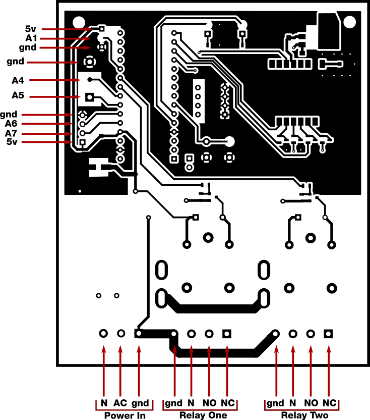
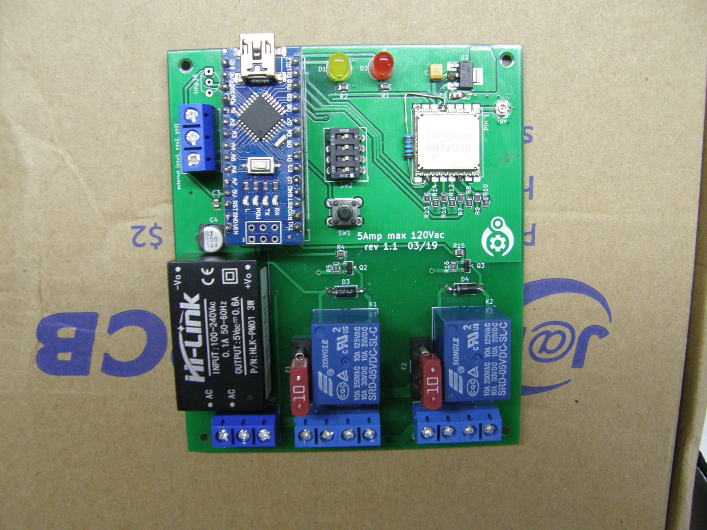

# Lora Remote Relays

AC powered relay control board using Lora radios. Turn on lights, heaters or whatever else you need at a distance.

## Notice about AC and relays!
##### Build at your own risk.
This devices runs on 110VAC, and controls other 110VAC devices. Do not make this if you don't know what you're doing! Power traces are very conservatively rated at 8 amp total (both relays combined), further changes and testing should increase this. There is no snubber circuity on the relays, so as-is should only be used with restive loads (lights, heaters, etc.). Small fans should be fine. Running motors should have proper circuitry in place on the relay outputs to handle any noise or back-EMF from such devices.

## Project status
Board design and code for v1.1 is completed and all is running well. Board v1.2 design is complete but code has not been written yet. Code for v1.1 should work almost as-is after changing the pin numbers. Primarily the difference between 1.1 and 1.2 is that 1.1 must poll the radio for new packets while the new version will use interrupts. Other changes are improved silkscreening and more IO breakouts for other projects.

## Pinout description

I've broken out some extra arduino pins for integration in future projects. Starting from the upper left:
  * The first three pins from upper-left down are 5 volts, Analog 1, and ground. This was originally used for a TMP36 analog temperature sensor. This would also work with any of the Dallas One-wire digital temperature sensors.
  * Next we have a terminal block with Ground, analog 4 and analog 5. My purpose for these is to include some external on/off switches for the relays. Could be handy to turn the lights on manually when already standing next to them. The terminal block
  * Final four pins are ground, analog 6, analog 7, and 5 volts. These are just for future projects and could be used for more external sensors, switches, or status LEDs
  * To the lower right of the Nano the serial pins are exposed for future ideas.

## Completed board
This is a photo of the complete v1.1 board. The schematics are up to date with v1.2, which adds some extra IO pins, adjusted silkscreen, and moved some parts to make them easier to work with (like moving the fuse holder farther away from the relays)

## Usage/code description
There are two PlatformIO project folders, one for the main program, one named 'circuit test'. The circuit test routing just verifies everything was connected correctly: blink leds, toggle relays, send a packet. Both programs are contained in the 'src/' folder and can be pulled from there if you wish to use the code with Arduino IDE.

Some of these software functions are in a state of change as I figure out how best to integrate these devices with my Lora home network, but the basic purpose remains the same:
  * Set local(self) and destination radio addresses (in the form of a byte in Hex format)
      * Destination address is read from the dip switches on startup. Simply make sure these are the same across all boards. In this case it is the address of the Lora radio on the Raspberry Pi that controls everything.
      * If the button is held on startup (or while the arduino nano reset button is pressed) blink the LEDs while in the 'set local address' function. Set the dip switches *different* on each board so each one can be uniquely addressed by whatever device you have turning the relays on and off. Press button again to write this new address to EEPROM.
  * Receive message on which relay to turn on or off
    * Currently this just listens for a message to the local address and a 2 index array of zeros and ones (i.e [1,0]). First element is what the first relay state should be, second is what the second relay state should be.
  * Reply with ACK after processing the previous message, or respond with current relay states when asked
    * This isn't quite complete yet but the plan is to implement a proper ack/nack response for more reliable operation.
    * The second thing is to reply to the message 'STAT' with the current status of both relays. The thinking is any one control device may turn the relays on and off, but it would be nice of other control devices could later know what their status is without toggling anything on or off. This also lets a controller know that a specific board is, in fact, online and reachable.

## TODO

- [ ] Create and upload a proper BOM
- [x] Finish and debug 'status' functions
- [ ] Further testing of board temperature rise at high currents
- [ ] Change from polling loop to pin-change interrupt
- [ ] Clean up lots of old comments, debug info and test functions
- [ ] Add some pictures and test results
